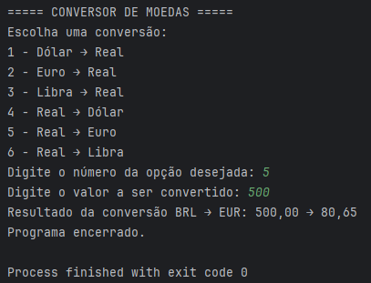

# Conversor_De_Moedas 💱

Projeto desenvolvido para o curso **ONE | TECH Foundation – Especialização Back‑End Alura**, que converte valores entre diferentes moedas usando a API ExchangeRate‑API.

---

## 🛠️ Tecnologias

- Java 17+
- Integração com ExchangeRate‑API
- Maven (ou Gradle, se preferir)

---

## 🚀 Funcionalidades

- Conversão de valores entre pares de moedas (ex: USD → BRL)
- Interface simples via console com menu interativo
- Tratamento de entradas inválidas

---

## 🧩 Pré‑requisitos

- Java instalado (versão 17 ou superior)
- Git instalado

---

## ⚙️ Como executar

1. Clone o projeto:
   ```bash
   git clone https://github.com/acpfromualdo/Conversor_De_Moedas.git
   cd Conversor_De_Moedas

---

## 🖼️ Screenshot do programa

 
